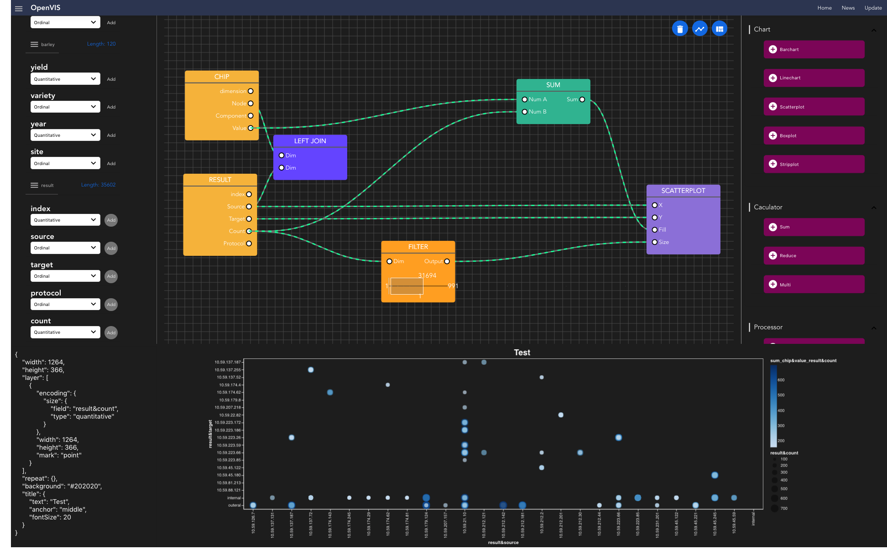
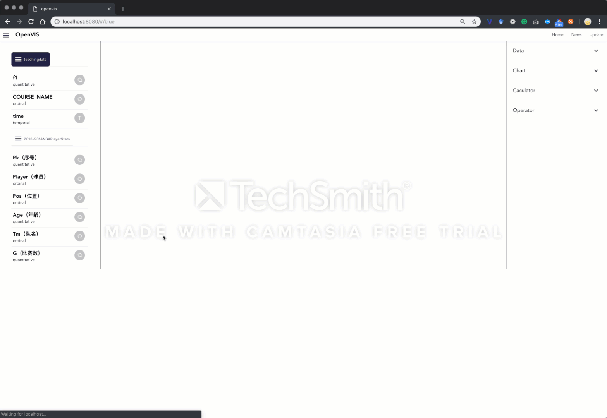

# ChartFlow - A Visualization Builder Via Editable Blueprint 

[](https://travis-ci.org/vega/vega-lite)
[](https://codecov.io/gh/vega/vega-lite)
[](https://github.com/prettier/prettier)



> A visualization building tool base on [vega-lite](https://vega.github.io/vega-lite/) and the idea Inspired by [Blueprint](https://docs.unrealengine.com/en-us/Engine/Blueprints/GettingStarted). Using module components and connection curve to define the data logic, visualiation and user interaction



## History

- 2018.12.7 v1.01

## Functions

- Data Connector (Outer Join, Inner Join)

- Data Processor (Filter, Normalizer)

- Data Calculator (Sum, Reduce and Multi)

- Data Visualizer (Barchart, Linechart, Scatterplot, Boxplot, Stripplot)

## Roadmap

- Support zoom and navigator(with a preview window) for the work borad.

- Add multi work borad, user can add multi borad and easy switch in them.

- Enable to define the interaction logic with blueprint

- Layout editor: users can define the dashborad's layout

## Build Setup
``` bash
# install dependencies
npm install

# serve with hot reload at localhost:8080
npm run dev
```

VIS & VR Team, Southwest University of Science & Technology. 
